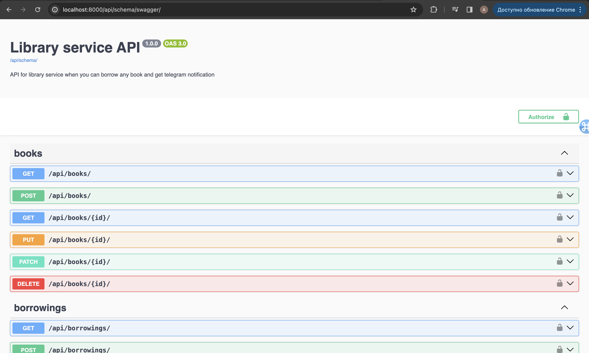
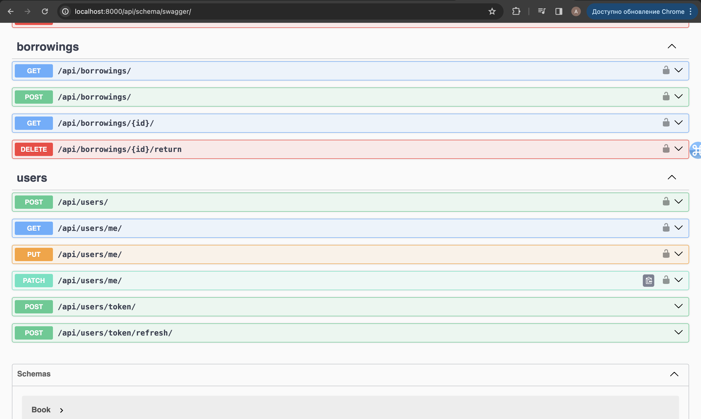

# Library Service API

## Getting Started

To get started with the Planetarium API Service, follow these steps:

1. Clone the repository:
   ```bash
   git clone https://github.com/Artemh59/Library-Service.git
   ```
   <br>
2. Navigate to the project directory:
   ```bash
   cd Library-Servicex
   ```
   <br>
3. Create and activate a virtual environment :
   ```bash
   python3 -m venv venv 
   ```
   ```bash
   source venv/bin/activate
   ```
   <br>
4. Install requirements:
   ```bash
   pip install -r requirements.txt
   ```
   <br>
5. Set up the environment variables:

   Create a .env file based on the provided .env.example.
   <br>
<br>
6. Make migrations:
   ```bash
   python manage.py makemigrations 
   ```
   ```bash
   python manage.py migrate 
   ```
   <br>
7. Run server:
   ```bash
   python manage.py run server 
   ```
   
## Accessing API:
1. `
Register:
/api/users/
`

2. `
Get token:
/api/users/token/
`
### USE THIS TOKEN IN ModHeader
   like this exemple

   Authorize:  JWT «token»
   
## Features:

#### Оne of the main features of this API is when you borrow or return your borrowed book, you receive a notification in telegram

## All endpoints of this API there:


